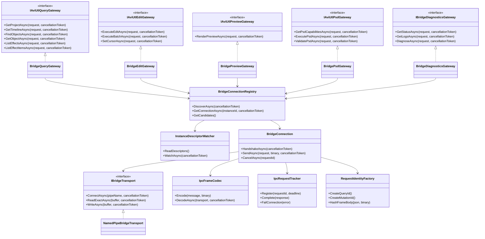
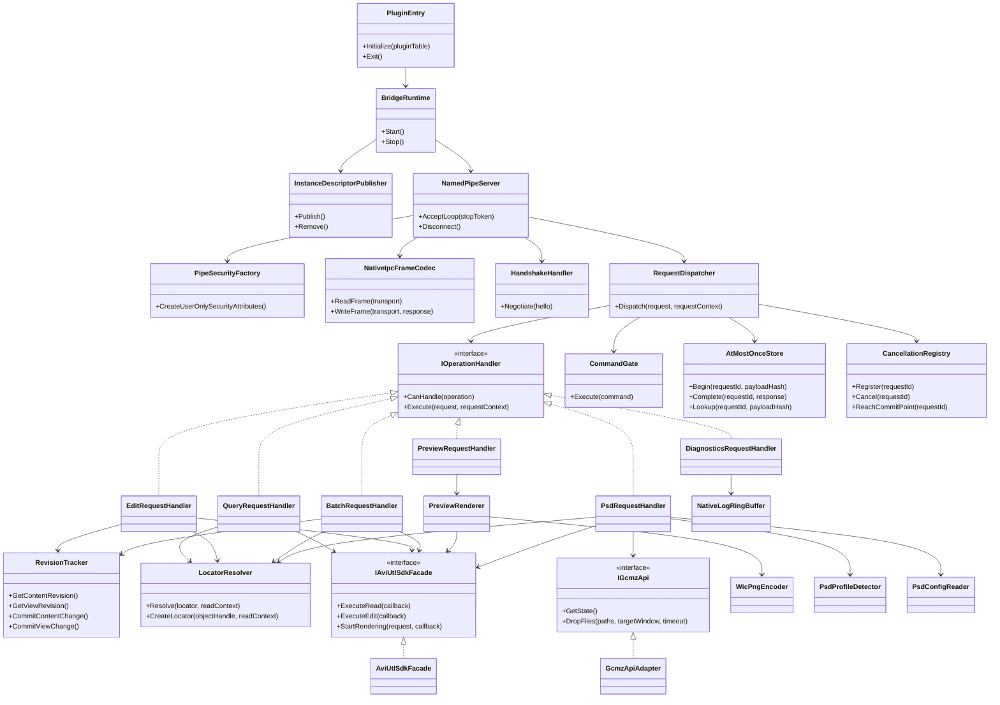
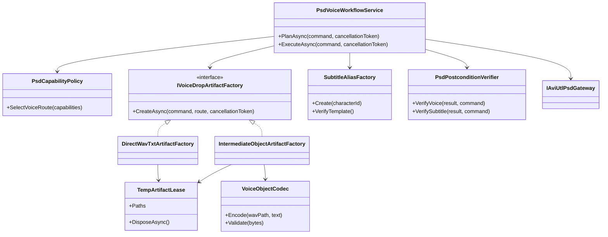
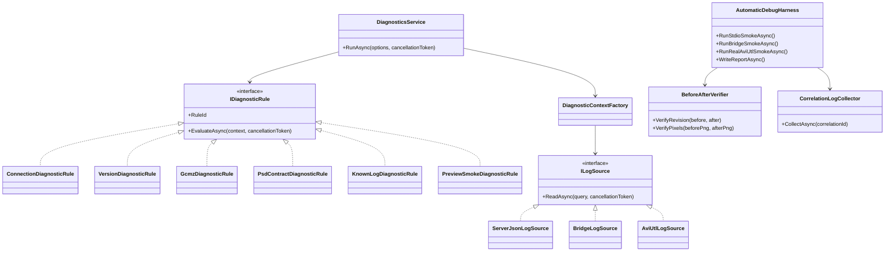
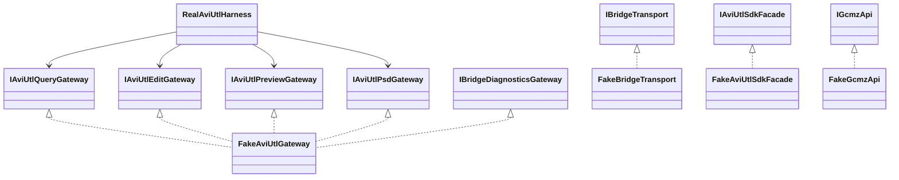

# AviUtl2 MCP Phase 3 クラス図

## 1. 文書状態

- フェーズ: Phase 3 クラス図
- 状態: 敵対的レビュー済み
- 入力: ユーザー承認済みの[Phase 2設計書](design.md)
- API契約: [MCP API設計](mcp-api.md)、[Schema catalog](../schemas/mcp/v1/catalog.json)
- IPC契約: [IPCプロトコル設計](ipc-protocol.md)
- PSD契約: [PSDToolKit2 / GCMZDrops互換契約](psd-contract.md)

本書のクラス名はPhase 4で使用する実装名とする。DTOは原則immutable record/structとし、図では責務を持つclassとinterfaceを中心に示す。

## 2. 設計規則

1. MCP Adapterはschema変換だけを担当し、業務検証やIPCを直接行わない。
2. Application serviceはWin32、named pipe、AviUtl2 SDK、GCMZDropsを参照しない。
3. gateway interfaceはquery/edit/preview/PSD/diagnosticsへ分離し、利用しない操作への依存を持たせない。
4. IPC transportはdomain DTOの意味を解釈せず、framing、相関、timeout、cancelだけを担当する。
5. native handlerはoperation群ごとに分け、`RequestDispatcher`へ業務分岐を集中させない。
6. SDK handleは`AviUtlSdkFacade`のread/edit callback内だけで使用し、callback外へは所有DTOだけを返す。
7. 変更revisionの確定、at-most-once判定、GCMZDrops送信は単一`CommandGate`内で順序づける。
8. PSD音声、字幕、temp artifactは専用classへ分離し、通常timeline編集へ混在させない。
9. static global service locatorや可変Singletonを作らず、composition rootから依存性注入する。

## 3. MCP Server / Application

```mermaid
classDiagram
    class McpServerBootstrap {
        +RunAsync(args, cancellationToken)
    }
    class McpCatalogRegistrar {
        +RegisterTools(serverBuilder)
        +RegisterResources(serverBuilder)
        +RegisterPrompts(serverBuilder)
    }
    class StatusToolSet {
        +GetStatusAsync(input, cancellationToken)
        +GetCapabilitiesAsync(input, cancellationToken)
    }
    class TimelineQueryToolSet {
        +GetProjectAsync(input, cancellationToken)
        +GetTimelineAsync(input, cancellationToken)
        +FindObjectsAsync(input, cancellationToken)
        +GetObjectAsync(input, cancellationToken)
        +ListEffectsAsync(input, cancellationToken)
        +ListEffectItemsAsync(input, cancellationToken)
    }
    class TimelineEditToolSet {
        +CreateObjectAsync(input, cancellationToken)
        +CreateMediaObjectAsync(input, cancellationToken)
        +CreateAliasObjectAsync(input, cancellationToken)
        +MoveObjectAsync(input, cancellationToken)
        +DeleteObjectAsync(input, cancellationToken)
        +SetObjectNameAsync(input, cancellationToken)
        +SetEffectItemAsync(input, cancellationToken)
        +SetEffectStateAsync(input, cancellationToken)
        +SetLayerAsync(input, cancellationToken)
        +SetCursorAsync(input, cancellationToken)
    }
    class BatchToolSet {
        +ExecuteBatchAsync(input, cancellationToken)
    }
    class DiagnosticsToolSet {
        +RenderPreviewAsync(input, cancellationToken)
        +GetLogsAsync(input, cancellationToken)
        +DiagnoseAsync(input, cancellationToken)
    }
    class PsdToolSet {
        +CreatePsdAsync(input, cancellationToken)
        +SetupPsdAsync(input, cancellationToken)
        +SetCharacterAsync(input, cancellationToken)
        +SetLayerStateAsync(input, cancellationToken)
        +CreateVoiceAsync(input, cancellationToken)
        +ValidatePsdAsync(input, cancellationToken)
    }
    class AviUtlResourceProvider {
        +ReadAsync(uri, cancellationToken)
    }
    class AviUtlPromptProvider {
        +GetAsync(name, arguments, cancellationToken)
    }
    class ToolResultMapper {
        +ToCallToolResult(applicationResult)
    }

    class ConnectionStatusService
    class CapabilityService
    class ProjectQueryService
    class TimelineQueryService
    class EffectCatalogService
    class ObjectEditService
    class EffectEditService
    class LayerViewEditService
    class BatchEditService
    class PreviewService
    class LogQueryService
    class DiagnosticsService
    class PsdObjectService
    class PsdVoiceWorkflowService
    class PsdValidationService

    class IInstanceSelector {
        <<interface>>
        +SelectAsync(instanceId, locators, cancellationToken)
    }
    class InstanceSelector
    class RequestValidator {
        +Validate(input)
    }
    class PagingCursorCodec {
        +Encode(state)
        +Decode(cursor, expectedBinding)
    }
    class ToolResultFactory {
        +Success(data, context)
        +Failure(error, context)
    }

    McpServerBootstrap --> McpCatalogRegistrar
    McpCatalogRegistrar --> StatusToolSet
    McpCatalogRegistrar --> TimelineQueryToolSet
    McpCatalogRegistrar --> TimelineEditToolSet
    McpCatalogRegistrar --> BatchToolSet
    McpCatalogRegistrar --> DiagnosticsToolSet
    McpCatalogRegistrar --> PsdToolSet
    McpCatalogRegistrar --> AviUtlResourceProvider
    McpCatalogRegistrar --> AviUtlPromptProvider

    StatusToolSet --> ConnectionStatusService
    StatusToolSet --> CapabilityService
    TimelineQueryToolSet --> ProjectQueryService
    TimelineQueryToolSet --> TimelineQueryService
    TimelineQueryToolSet --> EffectCatalogService
    TimelineEditToolSet --> ObjectEditService
    TimelineEditToolSet --> EffectEditService
    TimelineEditToolSet --> LayerViewEditService
    BatchToolSet --> BatchEditService
    DiagnosticsToolSet --> PreviewService
    DiagnosticsToolSet --> LogQueryService
    DiagnosticsToolSet --> DiagnosticsService
    PsdToolSet --> PsdObjectService
    PsdToolSet --> PsdVoiceWorkflowService
    PsdToolSet --> PsdValidationService

    IInstanceSelector <|.. InstanceSelector
    StatusToolSet --> ToolResultMapper
    TimelineQueryToolSet --> ToolResultMapper
    TimelineEditToolSet --> ToolResultMapper
    BatchToolSet --> ToolResultMapper
    DiagnosticsToolSet --> ToolResultMapper
    PsdToolSet --> ToolResultMapper
    TimelineQueryService --> PagingCursorCodec
    EffectCatalogService --> PagingCursorCodec
    LogQueryService --> PagingCursorCodec
    ToolResultMapper --> ToolResultFactory
```

### 3.1 Tool配置

| Adapter | Tool数 | Tool |
|---|---:|---|
| `StatusToolSet` | 2 | `aviutl_get_status`、`aviutl_get_capabilities` |
| `TimelineQueryToolSet` | 6 | `aviutl_get_project`、`aviutl_get_timeline`、`aviutl_find_objects`、`aviutl_get_object`、`aviutl_list_effects`、`aviutl_list_effect_items` |
| `TimelineEditToolSet` | 11 | `aviutl_create_object`、`aviutl_create_media_object`、`aviutl_create_alias_object`、`aviutl_move_object`、`aviutl_delete_object`、`aviutl_set_object_name`、`aviutl_set_effect_item`、`aviutl_set_effect_state`、`aviutl_set_layer`、`aviutl_set_cursor`、`aviutl_save_project` |
| `BatchToolSet` | 1 | `aviutl_execute_batch` |
| `DiagnosticsToolSet` | 3 | `aviutl_render_preview`、`aviutl_get_logs`、`aviutl_diagnose` |
| `PsdToolSet` | 6 | `aviutl_psd_create`、`aviutl_psd_setup`、`aviutl_psd_set_character`、`aviutl_psd_set_layer_state`、`aviutl_psd_create_voice`、`aviutl_psd_validate` |

合計29 toolsとし、tool class内にAviUtl2固有処理を実装しない。

### 3.2 Resource / Prompt配置

| Owner | 公開名 |
|---|---|
| `AviUtlResourceProvider` | `aviutl://status`、`aviutl://capabilities`、`aviutl://project/current`、`aviutl://timeline/current`、`aviutl://diagnostics/latest` |
| `AviUtlPromptProvider` | `edit_timeline_safely`、`setup_psd_character`、`add_voice_and_subtitle`、`diagnose_aviutl` |

Resourceは対応するread serviceを再利用し、別cacheや別のAviUtl2読取経路を作らない。Promptは静的手順と引数検証だけを持ち、取得時に編集を実行しない。

## 4. Application gateway境界とC# IPC client

gateway具象はdomain別の薄いadapterとし、共有するのは`BridgeConnectionRegistry`以下だけにする。これによりpreviewやPSDを使わないserviceが該当protocolへ依存しない。

## 5. Native Bridge

`RequestDispatcher`はoperation名からhandlerを選択するだけで、SDK/GCMZ処理を持たない。`CommandGate`は処理を実行する排他境界であり、domain分岐やrevision計算を持たない。

## 6. PSD音声・字幕ワークフロー

`DirectWavTxtArtifactFactory`のleaseはユーザーファイルを所有せず、cleanup対象を空にする。`IntermediateObjectArtifactFactory`だけが相関ID配下のtemp fileを所有し、安全確認後に削除する。`PsdVoiceWorkflowService`は生成済みlocatorを保持し、途中失敗を`partial_operation`へ変換する。

## 7. 診断と自動デバッグ

診断ruleは読取専用とし、自動修復interfaceを設けない。自動デバッグharnessは専用fixtureと起動PIDを必須にし、通常のユーザープロジェクトへ接続しない。

## 8. テストダブル

`FakeAviUtlGateway`はApplication単体テスト専用、`FakeBridgeTransport`はC# IPC client専用、native fakeはSDK callback/handle寿命とGCMZ部分失敗専用とし、1つのfakeへ異なる層の振る舞いを集約しない。

## 9. 所有関係と寿命

| Owner | 所有対象 | 終了条件 |
|---|---|---|
| `McpServerBootstrap` | DI container、stdio server、root cancellation | stdin closeまたはprocess cancellation |
| `BridgeConnectionRegistry` | instance候補、instanceごとの`BridgeConnection` | server shutdown、descriptor失効、bridge epoch変更 |
| `BridgeConnection` | pipe、reader loop、in-flight request | disconnectまたはregistry破棄 |
| `BridgeRuntime` | pipe server、descriptor、handler群 | AviUtl2 plugin exit |
| `NamedPipeServer` | 接続1件とI/O buffer | disconnect、protocol違反、plugin exit |
| `AtMostOnceStore` | mutation tombstoneと小応答cache | bridge epoch終了または契約上の件数/期限 |
| `PreviewRenderer` | render context、所有RGBA/PNG buffer | callback完了後のencode終了、またはshutdownまでの遅延完了 |
| `TempArtifactLease` | 相関ID配下の中間ファイルだけ | postcondition完了後の`DisposeAsync` |

SDK handle、callbackポインター、`PROJECT_FILE*`、render callback bufferはIPC DTOやApplication objectへ含めない。

## 10. 敵対的レビュー

| 指摘候補 | 判定 | 反映 |
|---|---|---|
| 1つの`BridgeGateway`が全domainを実装するとISP違反 | 妥当 | query/edit/preview/PSD/diagnosticsの5具象へ分割 |
| `RequestDispatcher`がGod Object化する | 妥当 | operation handler登録と選択だけに限定 |
| `PsdVoiceWorkflowService`がtemp、codec、subtitleまで所有する | 妥当 | artifact factory、codec、alias factory、postcondition verifierへ分割 |
| C#とnativeの両方でrevisionを確定すると競合する | 妥当 | Applicationはpreflight、native `RevisionTracker`だけがcommit revisionを確定 |
| query並列化がSDK handle寿命を破る | 妥当 | native `CommandGate`とSDK callback内DTO copyを必須化 |
| fakeが実装詳細を共有して不具合を隠す | 妥当 | Application、IPC、native SDK、GCMZでfakeを分離 |
| class数が過剰 | 一部妥当 | 29 toolごとのclassは作らず、6 Adapter群と責務単位serviceへ集約 |
| 診断が暗黙に修復する危険 | 妥当 | 読取専用ruleだけを公開し、修復interfaceを作らない |

レビュー後に循環依存はない。依存方向は `Server -> Application -> gateway interface <- BridgeClient`、native側は `transport -> dispatcher -> handler -> adapter` に固定する。

## 11. Phase 3完了条件

- 29 tools、5 resources、4 promptsの所有classが決まっている。
- C# Applicationとnative bridgeの依存方向が一方向である。
- query/edit/preview/PSD/diagnosticsのtest seamが存在する。
- SDK handle、revision、at-most-once、render、temp artifactのownerと寿命が明記されている。
- 敵対的レビューの指摘を本書へ反映している。
- [Phase 4実装計画](implementation-plan.md)の全work packageが本書のclassへ対応している。
