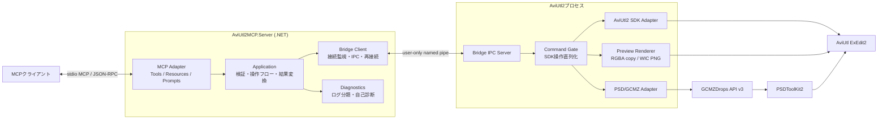
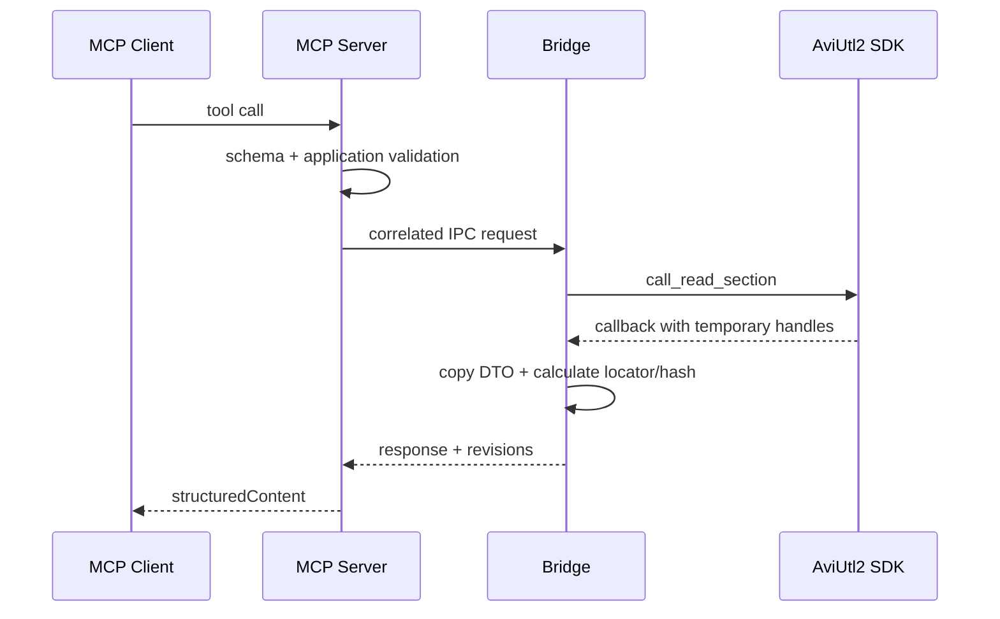
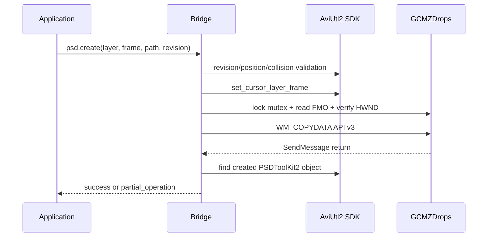

# AviUtl2 MCP Phase 2 設計書（承認済み）

## 1. 文書状態

- フェーズ: Phase 2 設計
- 状態: ユーザー承認済み（2026-07-18）
- 承認済み入力: [Phase 0 仕様書](specification.md)、[Phase 1 要件定義書](requirements.md)
- 実現性根拠: [V1 実現性マトリクス](feasibility.md)
- 対象環境: Windows 64-bit、AviUtl ExEdit2 2.1.0、PSDToolKit2、GCMZDrops

## 2. 設計目標

1. MCPクライアントがAviUtl2未起動時にもtools/resources/promptsを列挙できる。
2. AviUtl2 SDKのハンドル寿命、スレッド、Undo制約を破らずに参照・編集する。
3. PSDToolKit2の非公開IPCへ依存せず、公開SDKとGCMZDrops公開APIだけを使う。
4. 読取、dry-run、リビジョン照合、編集、事後検証を一貫した操作パイプラインにする。
5. ログ、相関ID、自己診断、プレビューを使って自動デバッグできる。
6. MCP、アプリケーション処理、IPC、AviUtl2 SDKを分離し、各層をテストダブルへ置換できる。

## 3. 技術選定

| 領域 | 採用 | 理由 |
|---|---|---|
| MCPサーバー | .NET 10 / C#、公式 `ModelContextProtocol` 1.4.1 | 公式SDKのstdio、DI、tools/resources/prompts、構造化出力を利用できる |
| MCP transport | stdioのみ | ローカルMCPクライアントとの互換性が高く、HTTP待受や認証を不要にできる |
| AviUtl2ブリッジ | MSVC 2022、C++20、CMake、汎用プラグイン `.aux2` | 公開SDKを直接呼び、AviUtl2プロセス内でGCMZDrops対象を照合できる |
| プロセス間通信 | Windows名前付きパイプ、byte mode、overlapped I/O | 同一ユーザーACL、再接続、双方向通信、バイナリ転送を実装できる |
| IPCペイロード | 固定長ヘッダー + UTF-8 JSON + 任意バイナリ | JSONの診断性を保ちつつ、PNGのBase64膨張をIPC内で避けられる |
| JSON | .NET `System.Text.Json`、C++ `nlohmann/json`固定版 | 厳密DTOと相互運用性を両立する |
| PNG | AviUtl2の `PIXEL_RGBA` をコピー後、Windows Imaging Componentでエンコード | 外部画像ライブラリを増やさず、完成PNGだけをMCP側へ送れる |
| ハッシュ | Windows CNGのSHA-256 | ロケーター指紋とバイナリ完全性を標準APIで計算できる |
| パッケージ | `.au2pkg.zip` + MCPサーバー配布フォルダー | AviUtl2標準導入方式とMCPクライアント設定を分離できる |

一次情報:

- [MCP C# SDK v1.4.1](https://github.com/modelcontextprotocol/csharp-sdk/tree/v1.4.1)
- [MCP stdio transport](https://modelcontextprotocol.io/specification/2025-11-25/basic/transports)
- [AviUtl2 SDK `plugin2.h`](https://github.com/aviutl2/aviutl2_sdk_mirror/blob/main/include/aviutl2_sdk/plugin2.h)
- [GCMZDrops 外部連携API](https://github.com/oov/aviutl2_gcmzdrops2/blob/main/API.md)
- [Windows名前付きパイプのセキュリティ](https://learn.microsoft.com/windows/win32/ipc/named-pipe-security-and-access-rights)

## 4. 全体アーキテクチャ



### 4.1 依存方向

```text
AviUtl2MCP.Server -> AviUtl2MCP.Application <- AviUtl2MCP.BridgeClient
                                              ^
                                              |
                              versioned IPC contract
                                              |
                                    AviUtl2MCP.Bridge
```

- `Application`はMCP SDK、名前付きパイプ、Win32、AviUtl2 SDKを参照しない。
- `Server`はMCPとApplication DTOの変換だけを行い、SDK固有処理を持たない。
- `BridgeClient`はIPC契約と接続状態だけを扱い、MCP型を参照しない。
- `Bridge`はAviUtl2 SDK、GCMZDrops、PNG生成を担当し、MCP仕様を知らない。

## 5. コンポーネント責務

| コンポーネント | 主責務 | 持たせない責務 |
|---|---|---|
| MCP Tool classes | 入力DTO、説明、annotations、Application呼出し、MCP結果化 | 名前付きパイプ、SDK、業務検証 |
| MCP Resources | 読取ユースケースのJSON表現 | 独自キャッシュ、編集 |
| MCP Prompts | 安全な操作手順のテンプレート | prompt取得時のAviUtl2操作 |
| Application services | 検証、dry-run、リビジョン、複合フロー、エラー正規化 | Win32、SDKハンドル |
| Bridge connection monitor | インスタンス発見、接続、handshake、再接続 | 自動編集、状態推測 |
| IPC codec | フレーム長、UTF-8、上限、相関 | 操作内容の解釈 |
| Bridge IPC server | ACL、接続、要求受付、応答送信 | SDKハンドルの永続化 |
| Command gate | SDK操作の直列化、期限、編集状態判定 | MCPレスポンス生成 |
| AviUtl2 SDK adapter | 読取/編集セクション、DTOへのコピー、能力検出 | コールバック外のSDKハンドル保持 |
| PSD/GCMZ adapter | 共有メモリ、対象ウィンドウ照合、WM_COPYDATA、PSD事後検証 | PSDToolKit2非公開IPC |
| Preview renderer | 非同期レンダリング、RGBA所有コピー、WIC PNG | 読取/編集ロック中の完了待ち |
| Diagnostics engine | 検査、根拠、影響、推奨対処、既知ログ分類 | 暗黙の修復 |

## 6. プロセスとインスタンス管理

### 6.1 MCPサーバー

- MCPクライアントが子プロセスとして起動する単一stdioセッションとする。
- stdinが閉じたら、接続中IPCをキャンセルして終了する。
- 28 tools、5 resources、4 promptsは常に静的登録する。AviUtl2未起動時も一覧を変えない。
- 全Console loggerをstderrへ送り、stdoutへMCP以外を一切書かない。

### 6.2 ブリッジ

- `RegisterPlugin`で編集ハンドル、イベントリスナー、プロジェクトload/saveハンドラーを登録した後にIPCを開始する。
- `UninitializePlugin`で受付停止、`CancelIoEx`、接続終了、ワーカーjoin、ディスクリプター削除を行う。`DllMain`では待機しない。
- プロジェクトパスは `PROJECT_FILE::get_project_file_path` の値をload/saveコールバック内でコピーしてキャッシュする。キャッシュ未確立時だけGCMZDrops FMOのproject情報を読取専用fallbackにし、未保存の空パスとproject未作成を区別する。読取だけのために編集セクションを開かない。

### 6.3 インスタンス発見

ブリッジは次のユーザー専用ディレクトリへ原子的にディスクリプターを保存する。

```text
%LOCALAPPDATA%\AviUtl2MCP\v1\instances\{instanceId}.json
```

ディスクリプターは `instanceId`、PID、プロセス開始時刻、pipe名、bridge/protocol/AviUtl2バージョンだけを含み、プロジェクトパスを含めない。MCPサーバーはPIDと開始時刻を照合し、終了済みまたはPID再利用済みのエントリーを無視する。

選択規則:

1. tool引数 `instanceId` があればそのインスタンスを使う。
2. 入力Locatorがすべて同じ `instanceId` を持つならそのインスタンスを使う。top-level指定と違えば `invalid_argument` とする。
3. 環境変数 `AVIUTL2_MCP_INSTANCE` があれば既定値にする。
4. 生存インスタンスが1つなら自動選択する。
5. 複数で未指定なら `aviutl_get_status` と `aviutl://status` だけは候補一覧を返し、その他の対象操作は `instance_ambiguous` で拒否する。

## 7. 座標系

MCP公開値はAviUtl2 UIと同じ1始まりに統一する。

| 値 | MCP | SDK境界 |
|---|---:|---:|
| `layer` | 1始まり | `layer - 1` |
| `frame` | 1始まり | `frame - 1` |
| `effect.occurrence` | 0始まり | `name:n` の `n` |
| 終了フレーム | 両端を含む | SDKの開始・長さから換算 |

全スナップショットに次を含め、クライアントが推測しなくてよい形にする。

```json
{"coordinateSystem":{"frameBase":1,"layerBase":1,"endInclusive":true}}
```

## 8. 状態、リビジョン、ロケーター

### 8.1 二種類のリビジョン

- `revision`: オブジェクト、レイヤー、プロジェクト、現在シーンの内容変更に対する楽観的ロック。
- `viewRevision`: カーソル、表示位置、選択、フォーカス変更に対するリビジョン。

`UPDATE_OBJECT`は`revision`、`CHANGE_EDIT_FRAME`と`CHANGE_FOCUS_OBJECT`は`viewRevision`、`CHANGE_EDIT_SCENE`は両方を更新する。トークンは次の値からなる不透明文字列とする。

```text
{instanceEpoch}:{projectGeneration}:{counter}
```

- `instanceEpoch`はIPC `serverEpoch`と同じUUIDを使い、ブリッジ再起動時だけ変更する。
- プロジェクトload/初期化時に`projectGeneration`を変更する。
- Command gate内の内容編集が成功した時点で、gateを解放する前に`counter`を同期的に単調増加し、そのtokenで事後readと応答を行う。
- event listenerは外部編集や遅延通知による追加invalidation専用とする。保守的な余分の増加は安全側の競合として許容し、同期更新をevent到着待ちにしない。

### 8.2 ObjectLocator

```json
{
  "instanceId": "uuid",
  "projectGeneration": "uuid",
  "sceneId": 0,
  "layer": 1,
  "startFrame": 1,
  "endFrame": 30,
  "name": "",
  "aliasSha256": "64 lowercase hex",
  "effectSignatureSha256": "64 lowercase hex"
}
```

解決手順:

1. instance、projectGeneration、sceneIdを照合する。
2. 指定layer/startFrame周辺の候補をSDK読取セクション内で列挙する。
3. endFrame、名称、alias SHA-256、ordered effect名とitem name/typeから作るeffect signature SHA-256を照合する。公開SDKでeffectとmoduleの対応を取得できないためmoduleを指紋に含めない。指紋一致が複数なら列挙順で選ばない。
4. 1件ならそのコールバック内だけハンドルを使用する。
5. 0件は `object_not_found`、複数件は `object_ambiguous` とする。

SDKの `OBJECT_HANDLE`、`EFFECT_HANDLE`、文字列ポインター、`PROJECT_FILE*` はコールバック外へ持ち出さない。応答へ必要な値はコールバック終了前に所有メモリへコピーする。

## 9. 操作パイプライン

### 9.1 読取



### 9.2 編集

1. MCPサーバーで型、上限、パス、必須revisionを検証する。
2. ブリッジのread sectionで対象、衝突、現在revisionを事前検証する。
3. `dryRun=true`なら予定差分だけを返す。
4. commit時は単一Command gateへ入り、編集直前にrevisionとロケーターを再照合する。
5. 1回の `call_edit_section_param` 内でSDK更新を行う。
6. 編集成功直後、Command gateを保持したままcontent counterを増加し、そのrevisionでread sectionの事後状態と新ロケーターを取得する。
7. 途中失敗は `partial_operation`、適用済み操作、再取得状態、`undoRecommended=true` を返す。

### 9.3 バッチ

- 最大100操作。
- `aviutl_execute_batch`の中にbatch、preview、logs、diagnose、GCMZDrops操作を含めない。
- SDKだけで完結するcreateObject/createMediaObject/createAliasObject/moveObject/deleteObject/setObjectName/setEffectItem/setEffectState/setLayerの9種類だけを対象にする。
- 全操作を事前検証した後、1回のedit sectionで順番に実行し、1 Undo単位にする。
- 公開SDKにロールバック関数はない。編集開始後の失敗は成功にせず `partial_operation` として返す。

## 10. PSDToolKit2 / GCMZDrops

### 10.1 依存境界

- PSD/PSB投入と音声ドロップだけGCMZDrops API v3を使う。
- PSD設定値の参照・更新、初期化・字幕エイリアス作成はAviUtl2公開SDKを使う。
- PSDToolKit2ウィンドウ用の非公開IPCは使用しない。
- GCMZDrops共有メモリのwindow/PIDと現在のAviUtl2ホストを照合し、別インスタンスなら無効化する。

### 10.2 PSD作成



GCMZDrops JSONは絶対フレームを持たないため、カーソル設定と送信の間はブリッジの単一Command gateでMCP要求同士を直列化する。Command gateはユーザーの手動UI操作を排他できないため、送信直前にカーソルとview revisionを再読取し、送信後は生成物のframe/layerを再検索する。計画位置と異なる生成、または位置を一意に確認できない結果は成功にせず `partial_operation` とし、手動カーソルを自動復元しない。

### 10.3 音声・字幕

1. WAV/TXT/LABの存在、拡張子、同名対応、サイズと必須`characterId`を検証する。
2. PSDToolKit2のversion profileと `PSDToolKit.json` を診断し、`external_wav_txt_pair=true`ならWAV/TXT直接投入、`external_object_audio_text=true`なら中間`.object`投入を選ぶ。どちらも無効なら`psdVoice=false`とする。
3. 中間経路では `%LOCALAPPDATA%\AviUtl2MCP\v1\temp\{correlationId}\voice.object` に音声・テキスト2 objectだけを持つUTF-8ファイルを作り、改行をliteral `\n`へ変換する。
4. カーソル設定後、選択した1経路だけをGCMZDrops API v3へ送信して `セリフ準備@PSDToolKit` を生成する。
5. 生成した音声準備を再検索し、ファイル名から推測された値に依存せず、必須`characterId`を公開SDKで設定して再取得する。
6. 同じ`characterId`を埋め込んだversioned字幕エイリアスを公開SDKで作成する。
7. 音声準備、字幕、LAB、口パク参照を個別に事後検証し、完了後に中間ファイルを削除する。
8. 一部だけ生成された場合は `partial_operation` と生成済みロケーターを返す。

検証環境の `PSDToolKit.json` は `external_wav_txt_pair=false`、`external_object_audio_text=true` のため、中間`.object`経路を標準実機fixtureにする。設定ファイルは診断・能力判定のために読むだけで、自動変更しない。正確な中間形式とcleanup契約は[PSD互換契約](psd-contract.md)で固定する。

## 11. プレビュー

1. SDKロック外で `rendering_scene_video` を投入する。
2. レンダリングスレッドのコールバック内でpitchを考慮し、`PIXEL_RGBA`を所有バッファへ直ちにコピーする。
3. `wait_rendering_task`はread/edit lock外だけで呼ぶ。
4. 専用エンコードワーカーでWICを使いPNG化し、必要なら指定最大寸法へ縮小する。
5. IPCバイナリ部でPNGを送り、MCP側はPNGシグネチャ、寸法、最大サイズを検証する。
6. MCP結果は構造化メタデータと `ImageContentBlock.FromBytes(png, "image/png")` を返す。

タイムアウト後もSDKコールバックが遅延実行できるよう、render contextは完了またはbridge shutdownまで所有する。キャンセルを理由に先に解放しない。

## 12. セキュリティ

| 境界 | 対策 |
|---|---|
| MCP stdio | stdoutはMCPメッセージ専用、ログはstderr、HTTP待受なし |
| 名前付きパイプ | 現在のlogon SIDとSYSTEMだけを許可する明示DACL、`PIPE_REJECT_REMOTE_CLIENTS`、`FILE_FLAG_FIRST_PIPE_INSTANCE` |
| クライアント確認 | `GetNamedPipeClientProcessId`を診断記録し、handshake前の操作を拒否 |
| 入力 | UTF-8厳密検証、未知JSON項目拒否、深さ・長さ・件数・バイナリ上限 |
| パス | `GetFullPathNameW`相当で正規化、存在・種別・許可拡張子を確認、シェル展開・コマンド実行なし |
| エイリアス | UTF-8、最大長、Objectセクション数、禁止NULを検証 |
| ログ | 字幕本文、エイリアス全文、ユーザーディレクトリ、秘密値をマスク |
| SDK | ハンドルをコールバック外へ保持しない。更新はedit section、参照はread section |
| 自動テスト | 専用一時プロジェクトとテスト起動PIDだけを対象にする |

同一ユーザーの別プロセスは信頼境界内とする。pipe名やディスクリプターを秘密として扱わず、Windows ACLを認可根拠にする。

## 13. 制限値

| 項目 | V1既定値 | 上限 |
|---|---:|---:|
| IPC JSON | - | 8 MiB |
| IPC binary | - | 16 MiB |
| IPC同時要求/接続 | 8 | 16 |
| Bridge接続数 | 1 | 1 |
| Bridgeグローバル待ち行列 | - | 64 |
| 変更request tombstone | - | 4096 / UUIDv7時刻から10分 |
| 完全変更response cache | - | 256件 / 1件64 KiB |
| timeline既定件数 | 100 | 1000 |
| batch操作数 | - | 100 |
| alias UTF-8 | - | 1 MiB |
| tool文字列 | 項目別 | 64 KiB |
| log取得行数 | 100 | 2000 |
| preview寸法 | 1920x1080内 | 4096x4096 |
| PNG応答 | - | 16 MiB |
| 状態取得timeout | 2秒 | 30秒 |
| 単一編集timeout | 10秒 | 120秒 |
| preview timeout | 30秒 | 120秒 |
| paging cursor有効期限 | 5分 | 5分 |

上限超過は切り詰めて成功扱いにせず、ページング可能な一覧だけcursorを返し、それ以外は `request_too_large` とする。

## 14. エラーとキャンセル

- JSON-RPC形式不正、未知tool、入力schema不正だけをMCP protocol errorにする。
- AviUtl2未起動、競合、非対応、タイムアウト、部分適用などは `CallToolResult.IsError=true` のtool errorにする。
- すべての応答に `correlationId` を付け、MCP/IPC/bridgeログで共通利用する。
- cancelは受付前・待ち行列中・read/preview待ちで協調的に処理する。
- `call_edit_section`開始後は安全に中断できないため完了まで追跡し、接続が切れても最終結果をログへ残す。
- timeout時に結果不明なら事後readを行い、変更有無を `operation_timeout` または `partial_operation` の詳細へ含める。

## 15. 自動デバッグ設計

### 15.1 構造化ログ

- MCPサーバー: stderr + `%LOCALAPPDATA%\AviUtl2MCP\logs\server-{pid}.jsonl`
- Bridge: AviUtl2 `LOG_HANDLE` + 制限付きメモリリングバッファ
- 共通項目: timestamp、level、component、eventId、correlationId、instanceId、operation、durationMs、resultCode
- tool引数全体や字幕本文は記録しない。

### 15.2 `aviutl_diagnose`

診断は次を独立チェックとして返す。

1. インスタンスディスクリプターとプロセス生存
2. pipe接続、handshake、protocol互換性
3. AviUtl2 edit stateとproject state
4. bridge/SDK/AviUtl2/PSDToolKit2/GCMZDropsバージョン
5. GCMZDrops Mutex、FMO、API v3、HWND/PID一致
6. PSDToolKit2必須エフェクト・エイリアス
7. 最新ログの既知パターン
8. 任意のread smokeとpreview smoke

各結果は `checkId`、status、evidence、impact、recommendation、canRetryを持つ。診断は読取専用で自動修復しない。修復が可能な場合も、利用者が既存の編集toolを別途明示的に呼ぶ。

### 15.3 既知ログルール

静的なバージョン管理済みルールで、PSDToolKit2のcache未作成、pipe終了、必須エフェクト未検出などを分類する。ユーザー入力の正規表現は実行しない。根拠行は件数・長さを制限し、パスをマスクする。

## 16. SOLIDとパターン

| 原則・パターン | 適用 |
|---|---|
| SRP | MCP変換、ユースケース、IPC、SDK、PSD、preview、diagnosticsを分離 |
| OCP | bridge operation handlerとdiagnostic ruleを登録式にし、既存dispatcherを変更せず追加可能にする |
| ISP | `IBridgeQueryClient`、`IBridgeEditClient`、`ILogReader`など利用側に必要な面だけ公開 |
| DIP | Applicationは `IAviUtlGateway`、`IClock`、`ILogSource`へ依存し、実named pipeへ依存しない |
| Adapter | AviUtl2 SDKとGCMZDropsを安定した内部DTOへ変換 |
| Command | 編集操作とbatch要素を検証・実行可能なcommandとして表現 |
| Strategy | ロケーター解決、診断ルール、PSD検出規則を交換可能にする |
| Facade | Application serviceがMCP層へ単純なユースケースAPIを提供 |
| State | bridge接続をDisconnected/Connecting/Ready/Incompatible/Faultedで管理 |

V1では独自イベントバス、汎用ワークフローエンジン、データベース、HTTPサーバー、プラグイン機構は導入しない。

## 17. リポジトリ構成

```text
/
├─ AviUtl2MCP.slnx
├─ Directory.Build.props
├─ Directory.Packages.props
├─ global.json
├─ CMakeLists.txt
├─ src/
│  ├─ AviUtl2MCP.Server/
│  ├─ AviUtl2MCP.Application/
│  ├─ AviUtl2MCP.BridgeClient/
│  └─ AviUtl2MCP.Bridge/
├─ tests/
│  ├─ AviUtl2MCP.UnitTests/
│  ├─ AviUtl2MCP.McpContractTests/
│  ├─ AviUtl2MCP.StdioTests/
│  ├─ AviUtl2MCP.Bridge.Tests/
│  ├─ AviUtl2MCP.BridgeIntegrationTests/
│  └─ AviUtl2MCP.RealAviUtlTests/
├─ schemas/
│  ├─ mcp/v1/catalog.json
│  └─ ipc/
├─ assets/psdtoolkit2/v1/subtitle.object
├─ packaging/
├─ scripts/
└─ docs/
```

依存バージョンは`Directory.Packages.props`、NuGet lock file、CMakeのcommit hashで固定する。V1は`PublishTrimmed=false`、Native AOTなしとする。

## 18. テスト戦略

| 層 | 内容 |
|---|---|
| Application単体 | locator、revision、dry-run、batch、PSD検証、エラー変換をAAA構造で検証 |
| IPC codec単体 | 分割read、境界長、無効magic/version/UTF-8、過大長、binary hash |
| Bridge native単体 | fake SDK tableでハンドル寿命、read/edit区分、部分失敗、render lifetimeを検証 |
| MCP contract | 公式C# clientとin-memory streamで28 tools、5 resources、4 prompts、schemas、annotationsを検証 |
| stdio black-box | 実Server.exeを起動し、stdout汚染、stderrログ、stdin close終了を検証 |
| named pipe統合 | fake bridgeで再接続、複数in-flight、cancel、timeout、切断、protocol不一致を検証 |
| 実機 | 専用一時プロジェクトでcreate/read/move/set/delete/Undo/preview/PSD/voiceを検証 |

実機テストは通常CIから分離し、明示的な`--real`、専用fixture、ハーネスが起動したPIDの一致を必須にする。既存ユーザープロジェクトを開かない。

revision単体・統合テストでは連続2編集を同じ旧revisionで送信し、1件目成功応答のrevisionが同期更新済みで、2件目が必ず `revision_conflict` になることを検証する。

## 19. ビルド・配布

- .NET: `dotnet restore --locked-mode`、`dotnet build`、`dotnet test`、win-x64 self-contained folder publish。
- Native: Visual Studio 2022 x64、CMake preset、Ninja、CTest。
- GitHub Actions: Windows runnerでrestore/build/unit/MCP/stdio/native/integration、成果物と`.au2pkg.zip`を生成。
- Release: bridge package、MCP server、checksums、MCP設定例、install/uninstall/doctor手順を同一バージョンで配布。
- bridge、server、IPC、schemaの各バージョンをstatus/capabilitiesへ出す。

## 20. 詳細契約

- MCP tools/resources/prompts: [MCP API設計](mcp-api.md)
- Machine-readable tool schema: [V1 Schema catalog](../schemas/mcp/v1/catalog.json)
- 名前付きパイプとメッセージ: [IPCプロトコル設計](ipc-protocol.md)
- PSDToolKit2/GCMZDrops profileとcodec: [PSD互換契約](psd-contract.md)

## 21. 要求トレーサビリティ

| 要求群 | 主な設計 | 主な検証 |
|---|---|---|
| FR-CON、FR-PRJ、FR-TLN | 6～9章、[MCP API 2～3章](mcp-api.md) | MCP contract、named pipe統合、Application単体 |
| FR-EDT、NFR-SAF | 7～9章、[MCP API 3.2～3.3](mcp-api.md) | Application/native単体、実機Undo、dry-run、競合 |
| FR-PSD | 10章、[MCP API 3.5](mcp-api.md)、[IPC 14章](ipc-protocol.md) | fake GCMZ、部分生成、PSD実機 |
| FR-PRV | 11章、[MCP API 3.4](mcp-api.md)、[IPC 10・13・15章](ipc-protocol.md) | render lifetime、timeout、画像contract、実機preview |
| FR-DIA | 15章、[MCP API 3.4](mcp-api.md) | log rule単体、切断・再接続、stdio black-box |
| FR-OPS、NFR-CMP | 3・17・19章 | locked restore、Windows CI、配布smoke |
| NFR-SEC | 12章、[IPC 3章](ipc-protocol.md) | 別logon SID接続拒否、入力境界テスト |
| NFR-PER | 13章、[IPC 10～11章](ipc-protocol.md) | 境界値、queue、巨大応答、並列要求 |
| NFR-REL | 8・14章、[IPC 12・13・16章](ipc-protocol.md) | request ID再送、cancel、切断、shutdown |
| NFR-TST | 18章 | 各テスト層のCI結果と実機レポート |

全AC IDの個別対応は[受け入れテスト対応表](acceptance-test-matrix.md)に固定する。

## 22. Phase 2レビュー項目

1. 28 tools、5 resources、4 promptsを全て契約化できているか。
2. SDKハンドルをコールバック外へ保持する経路がないか。
3. GCMZDrops複合操作を誤って原子的成功として扱っていないか。
4. 複数AviUtl2/MCPクライアントで誤接続・同時編集しないか。
5. stdin/stdout、pipe、ログ、パス、巨大応答の境界が安全か。
6. timeout/cancel後の遅延renderと編集結果を追跡できるか。
7. 全要件に自動または実機テストの証拠が対応するか。

## 23. Phase 2完了条件

- 本書、[MCP API設計](mcp-api.md)、[IPCプロトコル設計](ipc-protocol.md)を敵対的レビューし、指摘を反映する。
- 要件と設計判断のトレーサビリティを確認する。
- ユーザー承認後、Phase 3のクラス図へ進む。

Phase 3成果物は[クラス図](class-diagram.md)と[Phase 4実装計画](implementation-plan.md)に記録する。
