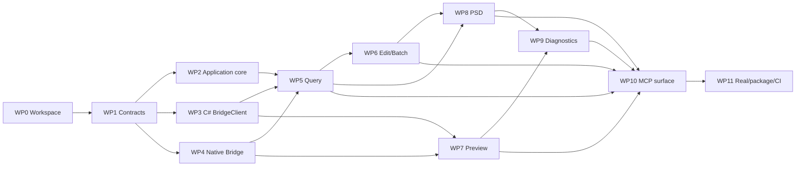

# AviUtl2 MCP Phase 4 実装計画

## 1. 文書状態

- 作成フェーズ: Phase 3
- 対象フェーズ: Phase 4 実装・テスト・自動デバッグ
- 状態: Phase 4実装中（2026-07-19 M1 Buildable skeleton完了）
- 設計入力: [Phase 2設計書](design.md)、[Phase 3クラス図](class-diagram.md)
- 完了証拠: [受け入れテスト対応表](acceptance-test-matrix.md)の33 AC
- M1証拠: locked restore、C# 8 project build、native `.aux2` build、28 tool schema conformance、C#/C++ 40-byte header golden vector
- M2進捗: 2026-07-19 WP2、W3.1～W3.6完了、W3.8実装中。実named pipe、handshake、in-flight/cancel相関、stale descriptor/registry、fake bridge逆順応答を.NET 56 testで検証済み。W3.7、W3.8再接続とWP4 Native Bridge基盤は実装中

V1の28 tools、5 resources、4 promptsを削減せず実装する。各末端taskは原則15～60分の検証可能な単位とし、失敗時に層を特定できる順で進める。

## 2. 問題分解

```text
Level 0: AviUtl2 MCP V1を実装・検証・配布する
├─ Level 1: 基盤と契約
│  ├─ Level 2: .NET/CMake workspace
│  ├─ Level 2: MCP/IPC DTOとschema conformance
│  └─ Level 2: 共通error、revision、locator、cursor
├─ Level 1: プロセス間通信
│  ├─ Level 2: C# bridge client
│  ├─ Level 2: native named pipe server
│  └─ Level 2: handshake、cancel、at-most-once
├─ Level 1: AviUtl2機能
│  ├─ Level 2: query
│  ├─ Level 2: edit/batch
│  ├─ Level 2: preview
│  ├─ Level 2: PSDToolKit2/GCMZDrops
│  └─ Level 2: logs/diagnostics
├─ Level 1: MCP公開面
│  ├─ Level 2: 28 tools
│  ├─ Level 2: 5 resources
│  └─ Level 2: 4 prompts
└─ Level 1: 品質と配布
   ├─ Level 2: unit/contract/stdio/native/integration tests
   ├─ Level 2: 専用実機harnessと自動デバッグ
   ├─ Level 2: package/installer/config examples
   └─ Level 2: Windows CIとrelease証拠
```

## 3. Work packages

### WP0 Workspaceと再現可能build

| ID | 末端task | 成果物・完了条件 | 依存 | 目安 |
|---|---|---|---|---:|
| W0.1 | `.NET 10.0.103`を固定 | `global.json`、`dotnet --version`一致 | - | 20分 |
| W0.2 | NuGet版を中央管理 | `Directory.Packages.props`とlock file、floating版なし | W0.1 | 40分 |
| W0.3 | solutionと3 C# project作成 | Server/Application/BridgeClientがwarning errorでbuild | W0.1 | 45分 |
| W0.4 | native project作成 | MSVC/CMake/Ninjaで空の`.aux2` targetがbuild | - | 45分 |
| W0.5 | 6 test project作成 | Unit/MCP/Stdio/Native/BridgeIntegration/Realを個別実行可能 | W0.3,W0.4 | 60分 |
| W0.6 | 共通warning/format規則設定 | nullable、analyzer、C++警告、UTF-8/CRLF規則がbuildへ反映 | W0.3,W0.4 | 40分 |

### WP1 契約とDTO

| ID | 末端task | 成果物・完了条件 | 依存 | 目安 |
|---|---|---|---|---:|
| W1.1 | primitive DTOを実装 | UUID、revision、path、placement、locatorがschema境界を検証 | W0.3 | 45分 |
| W1.2 | query DTOを実装 | status/project/timeline/effect/object DTOがJSON round-trip | W1.1 | 45分 |
| W1.3 | edit/batch DTOを実装 | 9 batch discriminatorとclosed argsがround-trip | W1.1 | 60分 |
| W1.4 | preview/log/diagnose DTOを実装 | PNG metadataと閉じたdiagnostic DTOがround-trip | W1.1 | 40分 |
| W1.5 | PSD DTOを実装 | profile、layerState、voice、validation DTOがround-trip | W1.1 | 45分 |
| W1.6 | IPC header/message DTOを実装 | 40-byte header layoutとmessage enumが両言語fixture一致 | W0.3,W0.4 | 60分 |
| W1.7 | Schema conformance testを作成 | 28 input/output schemaとC# DTOの代表値・拒否値を検証 | W1.2-W1.6 | 60分 |

### WP2 Application共通基盤

| ID | 末端task | 成果物・完了条件 | 依存 | 目安 |
|---|---|---|---|---:|
| W2.1 | `ApplicationResult`とerror mapping | 安定code、canRetry、partial dataを表現 | W1.1 | 40分 |
| W2.2 | request contextを実装 | correlation/instance/timeout/cancellationを一元生成 | W2.1 | 40分 |
| W2.3 | `InstanceSelector`を実装 | top-level/locator/env/唯一候補の優先順位とambiguous拒否 | W2.2 | 60分 |
| W2.4 | `RequestValidator`を実装 | frame/layer/path/string/countの横断上限を検証 | W1.1,W2.1 | 60分 |
| W2.5 | `PagingCursorCodec`を実装 | HMAC binding、期限、query/revision不一致を拒否 | W2.2 | 60分 |
| W2.6 | `CapabilityService`を実装 | 28操作、version、固定limit DTOを返す | W2.3 | 60分 |
| W2.7 | envelope/result mapperを実装 | MCP成功、tool error、partial、warningを一貫変換 | W2.1,W2.2 | 45分 |

### WP3 C# BridgeClient

| ID | 末端task | 成果物・完了条件 | 依存 | 目安 |
|---|---|---|---|---:|
| W3.1 | `IpcFrameCodec` encodeを実装 | JSON/binary/hash/headerのgolden bytes一致 | W1.6 | 45分 |
| W3.2 | partial read decodeを実装 | 1-byte分割、切断、過大長、無効UTF-8を安定判定 | W3.1 | 60分 |
| W3.3 | named pipe transportを実装 | async connect/read/write/cancel、stdout非使用 | W3.2 | 45分 |
| W3.4 | handshakeを実装 | major range、epoch、limits、rejection reasonを処理 | W3.3 | 45分 |
| W3.5 | in-flight trackerを実装 | 複数応答、timeout、disconnect、cancel ackを相関 | W3.4 | 60分 |
| W3.6 | descriptor watcher/registryを実装 | stale PID/epoch/重複/複数instanceを処理 | W3.4,W2.3 | 60分 |
| W3.7 | domain gateway 5種を実装 | query/edit/preview/PSD/diagnosticsが共通connectionを利用 | W3.5,W3.6 | 60分 |
| W3.8 | fake bridge統合testを実装 | reconnect、out-of-order、timeout、cancel、protocol不一致 | W3.1-W3.7 | 60分 |

### WP4 Native Bridge基盤

| ID | 末端task | 成果物・完了条件 | 依存 | 目安 |
|---|---|---|---|---:|
| W4.1 | plugin lifecycleを実装 | initialize/exitでruntimeを1回だけ開始・停止 | W0.4 | 45分 |
| W4.2 | instance descriptorを実装 | user-only directoryへatomic publish/remove、PID/epoch記録 | W4.1,W1.6 | 45分 |
| W4.3 | pipe securityを実装 | logon SID+SYSTEM DACL、remote拒否、first instance | W4.1 | 60分 |
| W4.4 | native frame codecを実装 | C# golden fixture、partial read、上限、hash一致 | W1.6,W4.3 | 60分 |
| W4.5 | handshake/sessionを実装 | 接続1件、protocol negotiation、client PID記録 | W4.2,W4.4 | 60分 |
| W4.6 | dispatcher/handler registryを実装 | 未知operation拒否、domain handlerへ委譲 | W4.5 | 45分 |
| W4.7 | `CommandGate`を実装 | bridge操作を直列化しshutdownで安全にdrain | W4.6 | 45分 |
| W4.8 | cancel/commit pointを実装 | commit前取消、commit後追跡、CancelAckを返す | W4.7 | 60分 |
| W4.9 | at-most-once storeを実装 | conflict/expired/evicted/cache hitをfixture検証 | W4.7 | 60分 |
| W4.10 | revision trackerを実装 | content/view分離、編集成功時gate内同期increment | W4.7 | 45分 |
| W4.11 | locator resolverを実装 | callback内再解決、0/1/複数件、hash/signature生成 | W4.10 | 60分 |
| W4.12 | native基盤testを作成 | ACL以外をfake transport/clock/storeで自動検証 | W4.1-W4.11 | 60分 |

### WP5 Query機能とread公開面

| ID | 末端task | 成果物・完了条件 | 依存 | 目安 |
|---|---|---|---|---:|
| W5.1 | SDK read facadeを実装 | callback内copy、handle非保持、例外境界を検証 | W4.11 | 60分 |
| W5.2 | status/project queryを実装 | 未接続/notOpen/saved/unsavedを構造化 | W5.1 | 45分 |
| W5.3 | timeline/find queryを実装 | range、page、selection、1000件上限 | W5.1 | 60分 |
| W5.4 | object detail queryを実装 | alias/effect/item/locatorを取得 | W5.1 | 60分 |
| W5.5 | effect catalog queryを実装 | definition/module/font/palette/item codecを分離 | W5.1 | 60分 |
| W5.6 | Application query serviceを実装 | instance選択、cursor、gateway error変換 | W3.7,W5.2-W5.5 | 60分 |
| W5.7 | read tool 8種を公開 | status/capabilitiesとquery 6種がschema一致 | W2.6,W2.7,W5.6 | 60分 |
| W5.8 | resource 5種を公開 | status/capabilities/project/timeline/diagnostics URI一致 | W5.7 | 45分 |
| W5.9 | read contract/stdio testを追加 | listと代表call、未起動時列挙、stdout汚染なし | W5.7,W5.8 | 60分 |

### WP6 Edit・dry-run・batch

| ID | 末端task | 成果物・完了条件 | 依存 | 目安 |
|---|---|---|---|---:|
| W6.1 | create 3種handlerを実装 | effect/media/aliasのpreflightとpost locator | W5.1,W4.10 | 60分 |
| W6.2 | move/delete/name handlerを実装 | revision/lock/collision、前後状態を返す | W5.1,W4.11 | 60分 |
| W6.3 | effect item/state handlerを実装 | type codec、occurrence、writable判定 | W5.5,W4.11 | 60分 |
| W6.4 | layer/cursor handlerを実装 | content/view revision分離とSDK補正値再取得 | W5.1,W4.10 | 60分 |
| W6.5 | dry-run plannerを実装 | commit APIを呼ばず同じvalidation/change DTOを返す | W6.1-W6.4 | 60分 |
| W6.6 | batch plannerを実装 | 9 op discriminator、全件preflight、参照制限 | W1.3,W6.5 | 60分 |
| W6.7 | batch executorを実装 | 1 edit section/Undo、部分適用IDとcurrent state | W6.6,W4.9 | 60分 |
| W6.8 | Application edit serviceを実装 | expectedRevision、dry-run、error mapping | W3.7,W6.1-W6.7 | 60分 |
| W6.9 | edit tool 11種を公開 | timeline 10種+batchがschema/annotation一致 | W2.7,W6.8 | 60分 |
| W6.10 | edit/Undo/競合testを追加 | stale revision、collision、部分失敗、再送を検証 | W6.9 | 60分 |

### WP7 Preview

| ID | 末端task | 成果物・完了条件 | 依存 | 目安 |
|---|---|---|---|---:|
| W7.1 | render context所有型を実装 | callback遅延、cancel、shutdownで二重解放なし | W4.7,W5.1 | 60分 |
| W7.2 | RGBA copy/pitch処理を実装 | padded pitchと上下方向fixtureが一致 | W7.1 | 45分 |
| W7.3 | WIC PNG encoderを実装 | aspect維持、no upscale、alpha composite、上限 | W7.2 | 60分 |
| W7.4 | IPC binary応答を実装 | hash/byteLength/headerとC#受信が一致 | W3.2,W4.4,W7.3 | 45分 |
| W7.5 | preview Application/toolを実装 | metadata+ImageContentを1件返す | W3.7,W7.4,W2.7 | 45分 |
| W7.6 | preview反復testを追加 | success/timeout/late completionを繰返し検証 | W7.5 | 60分 |

### WP8 PSDToolKit2 / GCMZDrops

| ID | 末端task | 成果物・完了条件 | 依存 | 目安 |
|---|---|---|---|---:|
| W8.1 | PSD profile detectorを実装 | 2.0.0alpha10 effect/item/version fixture一致 | W5.5 | 60分 |
| W8.2 | `PSDToolKit.json` readerを実装 | module隣接解決、UTF-8、欠落/不正/2 route判定 | W8.1 | 45分 |
| W8.3 | GCMZDrops adapterを実装 | Mutex/FMO/API v3/HWND/PID/project照合 | W4.7 | 60分 |
| W8.4 | PSD create/setupを実装 | cursor race、GCMZ投入、SDK setup、事後検索 | W6.4,W8.1,W8.3 | 60分 |
| W8.5 | character/layerStateを実装 | exact item/type、codec、round-trip、safeguard維持 | W6.3,W8.1 | 60分 |
| W8.6 | voice input/route policyを実装 | WAV/TXT/LAB/characterIdと能力をpreflight | W8.2,W2.4 | 45分 |
| W8.7 | intermediate object codecを実装 | 2 section、同一frame、改行escape、NUL/size拒否 | W8.6 | 60分 |
| W8.8 | temp artifact leaseを実装 | correlation配下だけcleanup、失敗warningを検証 | W8.7 | 45分 |
| W8.9 | subtitle alias factoryを実装 | template hash、placeholder、Lua escape、1 section | W8.6 | 60分 |
| W8.10 | voice workflowを実装 | direct/intermediate、ID設定、字幕、LAB、partial data | W8.3,W8.5,W8.8,W8.9 | 60分 |
| W8.11 | PSD validation rulesを実装 | setup/character/blink/lipSync/subtitleを個別判定 | W8.1,W8.5,W8.9 | 60分 |
| W8.12 | PSD Application/tool 6種を公開 | schema、capability isolation、annotation一致 | W3.7,W8.4-W8.11 | 60分 |
| W8.13 | fake profile/GCMZ contract testを追加 | 未知版、両route、設定不正、部分生成、誤配置 | W8.12 | 60分 |

### WP9 Logs・診断・自動デバッグ

| ID | 末端task | 成果物・完了条件 | 依存 | 目安 |
|---|---|---|---|---:|
| W9.1 | server JSON loggerを実装 | stderr+JSONL、stdout非使用、秘密値mask | W2.2 | 45分 |
| W9.2 | native ring/loggerを実装 | AviUtl LOG_HANDLEと制限ringへ同じ相関を記録 | W4.1 | 45分 |
| W9.3 | log source 3種を実装 | server/bridge/AviUtlをlimit/cursor/filter付きで読む | W3.7,W9.1,W9.2 | 60分 |
| W9.4 | diagnostic context/rulesを実装 | connection/version/GCMZ/PSD/log/previewを独立評価 | W8.1,W8.3,W9.3,W7.5 | 60分 |
| W9.5 | logs/diagnose toolを公開 | 閉じたDTO、読取専用、推奨対処を返す | W2.7,W9.3,W9.4 | 45分 |
| W9.6 | stdio自動debug scriptを実装 | 起動、initialize、list、代表call、stderr収集 | W5.9,W9.1 | 60分 |
| W9.7 | fake bridge自動debug scriptを実装 | 接続、切断、再接続、相関log report | W3.8,W9.3 | 60分 |
| W9.8 | before/after verifierを実装 | revision差とPNG pixel差を機械判定 | W6.9,W7.5 | 60分 |
| W9.9 | machine-readable debug reportを実装 | command、versions、checks、logs、artifact hashをJSON出力 | W9.6-W9.8 | 45分 |

### WP10 MCP promptsと全公開契約

| ID | 末端task | 成果物・完了条件 | 依存 | 目安 |
|---|---|---|---|---:|
| W10.1 | MCP composition rootを完成 | stdio server、DI、全Adapterを登録 | W5.7,W6.9,W7.5,W8.12,W9.5 | 45分 |
| W10.2 | prompt 4種を実装 | 引数schemaと安全手順が設計表に一致 | W10.1 | 45分 |
| W10.3 | catalog parity testを実装 | 28/5/4の名前、schema、description、annotationを比較 | W10.1,W10.2 | 60分 |
| W10.4 | MCP black-box testを完成 | initialize/list/read/prompt/tool/image/error/closeを検証 | W10.3 | 60分 |

### WP11 実機harness・package・CI

| ID | 末端task | 成果物・完了条件 | 依存 | 目安 |
|---|---|---|---|---:|
| W11.1 | 専用実機fixtureを作成 | 一時project、media、PSD、WAV/TXT/LAB、期待hashを同梱 | W8.13 | 60分 |
| W11.2 | real harnessのPID guardを実装 | harness起動PIDと専用project一致なしでは編集拒否 | W11.1,W9.9 | 60分 |
| W11.3 | read/edit/Undo実機testを実装 | AC-EDTとrevision/locatorを専用projectで検証 | W6.10,W11.2 | 60分 |
| W11.4 | preview/診断実機testを実装 | PNG、timeout、known logs、reconnectを検証 | W7.6,W9.5,W11.2 | 60分 |
| W11.5 | PSD実機testを実装 | installed intermediate route、setup、layer、voice、LABを検証 | W8.13,W11.2 | 60分 |
| W11.6 | `.au2pkg.zip` packagingを実装 | bridge、server、asset manifest、licenseを再現可能生成 | W10.4,W11.3-W11.5 | 60分 |
| W11.7 | MCP client設定exampleを作成 | 絶対path、stdio command、複数instance指定を記載 | W11.6 | 30分 |
| W11.8 | Windows CIを実装 | restore locked/build/unit/contract/native/stdio/packageを実行 | W10.4,W11.6 | 60分 |
| W11.9 | 33 AC証拠を集約 | test名、report、artifactをmatrixへ逆リンク | W11.3-W11.8 | 60分 |

## 4. 依存関係



クリティカルパスは `WP0 -> WP1 -> WP3/WP4 -> WP5 -> WP6 -> WP8 -> WP9 -> WP10 -> WP11`。previewはWP5/6と部分並列できるが、最終diagnosticsとMCP公開契約の前提になる。

## 5. 並列実行可能グループ

| Group | 実行可能task | 合流条件 |
|---|---|---|
| P1 | W0.3 C# workspace、W0.4 native workspace | W0.5 test projects |
| P2 | WP2 Application core、WP3 C# IPC、WP4 native基盤 | WP5 query統合前 |
| P3 | W5.2 project、W5.3 timeline、W5.4 object、W5.5 effects | W5.6 query service |
| P4 | W6.1 create、W6.2 object edit、W6.3 effect、W6.4 layer/view | W6.5 dry-run、W6.6 batch |
| P5 | WP7 preview、W8.1～W8.3 PSD検出基盤、W9.1～W9.2 logging | WP8/WP9統合前 |
| P6 | W11.3 edit実機、W11.4 preview診断実機、W11.5 PSD実機 | W11.6 packageとW11.9証拠集約 |

同じfileや共通dispatcherを変更するtaskは並列化せず、domain handlerまたはtest fixtureが独立している場合だけ並列化する。

## 6. 推奨実装順序とmilestone

| Milestone | 到達条件 | 自動検証 |
|---|---|---|
| M1 Buildable skeleton | WP0～WP1完了 | locked restore、C# build、native build、schema test |
| M2 Connected bridge | WP2～WP4完了 | fake bridge handshake/reconnect/cancel/at-most-once |
| M3 Read-only MCP | WP5完了 | MCP initialize/list、read 8 tools、5 resources |
| M4 Safe editing | WP6完了 | dry-run、revision、9 batch op、Undo、再送 |
| M5 Visual diagnostics | WP7とWP9基礎完了 | PNG contract、late render、logs、debug report |
| M6 PSD workflow | WP8完了 | 2 voice route、config isolation、partial operation |
| M7 V1 complete | WP9～WP11完了 | 28/5/4 parity、33 AC、package smoke、実機report |

各milestoneでtestが失敗したまま次へ進まない。同じ原因へ3回失敗した場合は、試行、失敗理由、別approachをdebug reportへ残して設計判断を見直す。

## 7. 自動デバッグloop

1. build前にtoolchain、dependency lock、schema parseを検証する。
2. unit testは相関IDとseedを固定し、失敗時に入力fixtureを保存する。
3. fake bridge testはIPC frameとstate transitionを機密値なしでJSONLへ保存する。
4. stdio black-boxはstdoutをprotocol parserへだけ渡し、stderrとserver JSONLを別収集する。
5. native testはfake SDK handleをcallback終了時に無効化し、解放後使用を即失敗させる。
6. preview testは正常、timeout、cancel、遅延完了を反復し、所有buffer数が0へ戻ることを確認する。
7. PSD testはGCMZ receiptだけでなくSDK再検索、character ID、字幕、LABを個別assertする。
8. 実機testは専用project、harness起動PID、事前snapshotを確認してから編集する。
9. 失敗時は`correlationId`でserver/bridge/AviUtlログを集約し、before/after revisionとPNG hashをreportへ含める。
10. test runnerが起動したprocess、temp correlation directoryだけをfinallyでcleanupする。

予定script:

- `scripts/Test-McpStdio.ps1`: MCP initialize/list/call/resource/promptとstdout汚染検査
- `scripts/Test-BridgeIntegration.ps1`: fake bridgeの再接続、cancel、timeout、at-most-once
- `scripts/Test-RealAviUtl.ps1`: 専用実機fixture、PID guard、before/after、Undo、preview、PSD
- `scripts/New-DebugReport.ps1`: version、command、test、相関log、artifact hashのJSON report

## 8. 受け入れ基準の実装割当

| AC群 | 主work package | 補助work package |
|---|---|---|
| AC-BLD-001～003 | WP0、WP11 | WP1 |
| AC-MCP-001～005 | WP3、WP5、WP10 | WP2、WP4、WP9 |
| AC-EDT-001～008 | WP5、WP6 | WP3、WP4、WP11 |
| AC-PSD-001～007 | WP8 | WP6、WP9、WP11 |
| AC-DIA-001～006 | WP7、WP9 | WP3、WP4、WP11 |
| AC-SAF-001～004 | WP2、WP4、WP6 | WP9、WP11 |

個別test IDと33 ACの1対1対応は[受け入れテスト対応表](acceptance-test-matrix.md)を正本とする。

## 9. リスクと先行probe

| Risk | 先行probe | 失敗時の別approach |
|---|---|---|
| AviUtl2 SDK callback/thread制約 | W5.1で最小read、W6.1で最小editを実機確認 | native facadeの実行queueをmain callback境界へ寄せる |
| `.aux2` package/build差異 | W0.4で空pluginを最初にpackage load | 公式package sampleのCMake layoutへ合わせる |
| named pipe ACL差異 | W4.3でcurrent/別logon SID test | SDDL生成をやめ明示ACL APIへ切替 |
| render遅延完了 | W7.1で所有context counterを先行実装 | shutdownまでquarantineするbounded registry |
| GCMZ cursor race | W8.4で送信前後readと誤配置fixture | 成功扱いをやめpartial+locator返却を維持 |
| PSDToolKit2設定差異 | W8.2でinstalled JSONと2 route fixture | `psdVoice`だけ能力無効化し診断を返す |
| MCP SDK API差異 | W5.7前に最小stdio/list probe | 公式v1.4.1 sampleに合わせAdapterだけ修正 |

## 10. 敵対的レビュー

| 観点 | 発見 | 反映 |
|---|---|---|
| 機能削減 | queryやPSDを後回しにしたままMVP完了扱いする危険 | M7だけをV1完了とし28/5/4 parityを必須化 |
| 粒度 | native bridgeやPSDが1 taskでは大きすぎる | codec、route、lease、postcondition等を60分以下へ分割 |
| 循環依存 | diagnosticsが全domainを前提にし実装を止める | logging基礎を先行し、diagnostic ruleを後から合流 |
| テストの偽陽性 | GCMZ receiptやSendMessage returnだけで成功になる | SDK再検索と個別事後条件を必須化 |
| 実機破損 | 開いているユーザープロジェクトへtestする危険 | 専用fixture+起動PID guardなしでは編集拒否 |
| 再送重複 | timeout testが新request IDで再試行する危険 | 同一UUIDv7/payloadと異payloadの両fixtureを必須化 |
| debug不能 | stdout/stderr/bridge logが混ざる危険 | source別収集とcorrelation reportを先行実装 |
| 依存更新 | floating packageで再現性を失う危険 | central version、lock file、locked restoreをM1条件化 |

レビュー後、循環依存はなく、各末端taskに成果物と検証条件がある。Phase 4ではM1から順に実装し、各milestoneを論理単位でコミットする。

## 11. Phase 4完了条件

- Windows x64でC# serverとnative `.aux2`がclean buildできる。
- 28 tools、5 resources、4 promptsがmachine catalogと一致する。
- unit、schema、MCP contract、stdio、native、bridge integration testが成功する。
- 専用実機でread/edit/Undo/preview/PSD/voice/diagnosticsを検証する。
- 33 ACすべてに成功証拠または明示的な実機reportがある。
- `.au2pkg.zip`、MCP server配布物、設定例、license、導入/診断手順を生成する。
- Git/GitHubへ論理単位のcommitをpushし、作業treeがcleanである。
